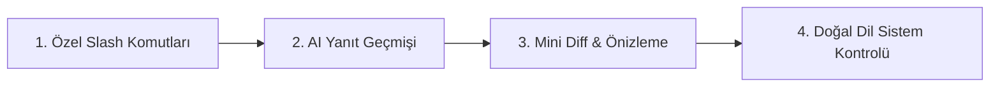

# 💡 CoreType Linux — Gelecek Özellikler & Yol Haritası Fikirleri

Bu belge, CoreType Linux projesinin temel altyapısı (KDE Wayland/X11 entegrasyonu, bağımsız release mimarisi, KWin pencere tespiti ve arayüz sistemi) tamamlandıktan sonra hayata geçirilmesi hedeflenen öncelikli fikirleri içerir.

---

## 📌 1. Özel Slash Komutları & Akıllı Şablon Motoru (Custom Prompt Engine)
> *Mevcut 17 statik slash komutunun ötesine geçerek kullanıcının kendi iş akışlarına özel komutlar ve şablonlar tanımlayabilmesi.*

### 🎯 Amaç ve Kapsam
Kullanıcı Ayarlar ekranındaki yeni bir "Komutlar & Şablonlar" sekmesinden kendi `/komut` tetikleyicilerini oluşturabilir. Her komut, yapay zekaya gönderilecek özel bir sistem/kullanıcı şablonuna ve dinamik değişkenlere sahip olur.

### 🧩 Dinamik Değişken Desteği
- `{selection}` : O an aktif pencerede seçili/karalanmış metin.
- `{clipboard}` : Sistem panosundaki mevcut veri.
- `{os}` : Dağıtım ve masaüstü ortamı (örn: `CachyOS - KDE Plasma 6 Wayland`).
- `{active_app}` : Komutun çağrıldığı pencere sınıfı (örn: `konsole`, `code`, `brave-browser`).
- `{shell}` : Aktif kabuk (örn: `fish`, `bash`, `zsh`).
- `{args}` : Kullanıcının slash komutundan sonra yazdığı ek parametreler.

### 🌟 Örnek Senaryolar
1. **/commit** → `git diff çıktısı veya seçili kod için Conventional Commits formatında Türkçe commit mesajı üret.`
2. **/refactor** → `{selection} kodunu Clean Code ve SOLID prensiplerine göre optimize et, açıklamaları Türkçe yaz.`
3. **/sql** → `{args} isteğini PostgreSQL/SQLite için optimize edilmiş SQL sorgusuna dönüştür.`
4. **/açıkla** → `{selection} içindeki mantığı veya hata çıktısını yeni başlayan birine anlatır gibi açıkla.`

### ⚖️ Artılar & Zorluklar
- ✅ **Artılar:** Sınırsız kişiselleştirme, yazılımcı/yazar/öğrenci gibi farklı kullanıcı profillerine anında uyum, sıfır kod değişikliğiyle yeni özellikler katabilme.
- ⚠️ **Zorluklar:** Ayarlar arayüzünde şık bir şablon editörü ve değişken doğrulama UI'ı gerektirir.

---

## 📌 2. AI Yanıt & Komut Geçmişi Kasası (History & Quick Search)
> *Daha önce CoreType ile üretilen mükemmel yanıtların, kod parçalarının ve çevirilerin kaybolmasını önleyen yerel hafıza.*

### 🎯 Amaç ve Kapsam
CoreType ile üretilen her sonuç, şifrelenmiş/güvenli yerel bir depolamada (SQLite veya JSON veri tabanı) tarih, kullanılan model, aktif uygulama ve girdi-çıktı çifti olarak indekslenir.

### 🚀 Kullanım Deneyimi
- CoreType arama kutusu boşken klavyeden **`Yukarı Ok (↑)`** tuşuna basıldığında veya arama kutusuna **`/geçmiş`** (veya `Ctrl + H`) yazıldığında son kullanılanlar listelenir.
- Liste içinde anlık arama (fuzzy search) yapılabilir.
- Listeden seçilen geçmiş bir kayıt:
  - `Enter` ile doğrudan imlece yapıştırılabilir.
  - `Ctrl + C` ile panoya kopyalanabilir.
  - Tekrar düzenlenip yeni bir AI komutu olarak tetiklenebilir.

### ⚖️ Artılar & Zorluklar
- ✅ **Artılar:** Çevrimdışı çalışır, daha önce üretilen değerli bir komutu veya metni kaybetme riskini sıfırlar, Raycast benzeri profesyonel bir güç aracı deneyimi sunar.
- ⚠️ **Zorluklar:** Şifreler veya hassas kişisel veriler içeren sorguların geçmişe yazılmaması için "Gizli Mod" veya "Geçmişi Temizle" kontrolleri eklenmelidir.

---

## 📌 3. Çift Modlu Yanıt Akışı: Doğrudan Enjeksiyon vs. Mini Diff / Önizleme
> *Üretilen metnin doğrudan yapıştırılması yerine, kullanıcının kontrolünü ve güvenliğini artıran akıllı önizleme ve fark görünümü.*

### 🎯 Amaç ve Kapsam
Şu anda CoreType iki moda sahiptir: doğrudan yapıştırma veya tam metin önizleme. Bu özellik, özellikle kod veya metin düzenleme senaryolarında orijinal metin ile yeni metin arasındaki farkları renkli satırlarla gösteren modern bir **Mini Diff** motoru sunar.

### 🚀 Kullanım Deneyimi
1. **Mini Diff Görünümü:** Metin seçilip `/düz`, `/refactor` veya `/çevir` çalıştırıldığında; silinen kısımlar kırmızı (`-`), eklenen kısımlar yeşil (`+`) vurgulanır.
2. **Aksiyon Çubuğu (Action Bar):**
   - `Enter` → Doğrudan değiştir / yapıştır.
   - `Ctrl + C` → Yalnızca yeni sonucu kopyala (orijinal metne dokunma).
   - `Tab` → Yanıt üzerinde hızlı bir düzenleme yapıp öyle gönder.
   - `Esc` → İşlemi tamamen iptal et.

### ⚖️ Artılar & Zorluklar
- ✅ **Artılar:** Büyük kod bloklarında veya önemli dosyalarda yapay zekanın yanlış bir şeyi ezmesini önler; geliştiriciye %100 güven verir.
- ⚠️ **Zorluklar:** Kısa tek satırlık çıktılarda gereksiz kalabalık yaratmamak için yalnızca çok satırlı veya seçili metin içeren operasyonlarda devreye girmelidir.

---

## 📌 4. Doğal Dil ile Sistem Kontrolü & Masaüstü Otomasyonu (Desktop Actions)
> *Linux işletim sistemini konsol komutlarını ezberlemek zorunda kalmadan günlük konuşma diliyle yönetebilme.*

### 🎯 Amaç ve Kapsam
Kullanıcının CoreType penceresine yazdığı doğal dil komutları sistem üzerinde uygun Linux komutlarına (`pactl`, `playerctl`, `systemctl`, `qdbus`, `kwin`) dönüştürülür ve onay sonrası sessizce yürütülür.

### 🌟 Örnek Komutlar ve Karşılıkları
- *"Sesi %40 yap"* → `pactl set-sink-volume @DEFAULT_SINK@ 40%`
- *"Spotify sonraki şarkı"* → `playerctl -p spotify next`
- *"Ekranı kilitle"* → `loginctl lock-session`
- *"Karanlık temaya geç"* → KDE Plasma tema DBus sinyali
- *"Docker'daki durmuş konteynerleri temizle"* → `docker container prune -f`
- *"Şu portu kullanan işlemi bul: 1420"* → `lsof -i :1420` çıktısını analiz edip kullanıcıya bildirme

### 🛡️ Güvenlik ve Onay Mekanizması
- Güvenli işlemler (ses, medya, ekran kilitleme) anında çalıştırılır ve durum çubuğunda bildirim gösterilir.
- Riskli veya yıkıcı komutlar (`rm`, `kill`, `systemctl stop`, `reboot` vb.) için CoreType ekranında *"Bu komut çalıştırılsın mı: [komut]"* onay kutusu gösterilir.

### ⚖️ Artılar & Zorluklar
- ✅ **Artılar:** Linux masaüstünü olağanüstü modern, akıllı ve konuşarak kontrol edilebilen bir işletim merkezine dönüştürür.
- ⚠️ **Zorluklar:** Komutların güvenli bir sandbox / izin kontrolünden geçirilmesi kritik önem taşır.

---

## 🗺️ Önerilen Uygulama Sırası

